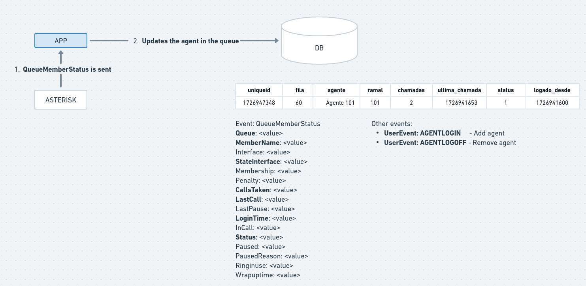

# Asterisk Callcenter AMI Monitoring

This project has the goal to make possible update the status of logged agents based on generated QueueMemberStatus Asterisk AMI event. The agent metrics are in an table called `monitoring_agents` inside Postgres database.

### Architecture

